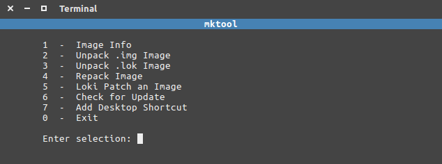

## TWRP Nexus5X 4core image and mktool v3.1

To use it, download [twrp-3.2.3-0-bullhead-4core.img](blob/master/output/twrp-3.2.3-0-bullhead-4core.img) and boot it with ``fastboot boot twrp-3.2.3-0-bullhead-4core.img`` from the stock bootloader.

Changed extracted/configs/recovery.img-cmdline to 4 Cores according to [4Core-Android-0-5X boot.img](https://github.com/xcnathan32/4Core-Android-O-5X/commit/a4814e7e9c05e09d41ad1621f9d95f7eea409d77). The changes are recorded in ``cmdline.patch``.

This way TWRP will work on bootlooping Nexus 5X devices, which are broken due to their big CPUs failing due to production mistakes. See the xda-developers thread under Resources below.

mktool is used for unpacking & repacking the originally release
TWRP recovery image.

**Project page for mktool:**
https://intechgeek.com/mktool/

### Resources
- [xda dev Nexus5X bootloop](https://forum.xda-developers.com/nexus-5x/general/untested-nexus-5x-bootloop-death-fix-t3641199)
- [TWRP](https://github.com/TeamWin/Team-Win-Recovery-Project)
- [mktool](https://intechgeek.com/mktool/)
